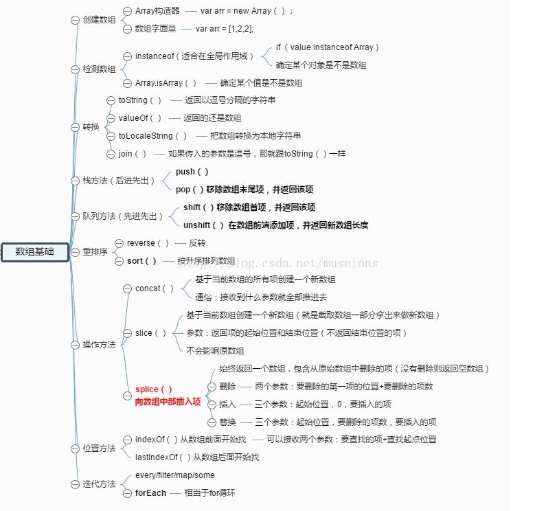
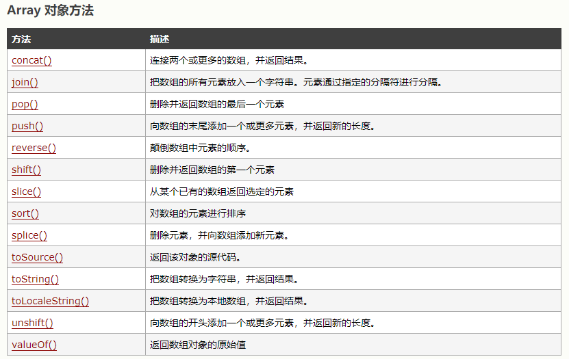

# Javascript 面试总结

 



正则匹配

-  ^  以。。。开头，
- $ 以。。。结尾。 
- *任意多次
-  | 或的意思 
-  （ ）组
-   []集合 

TypeOf

- typeof Symbol()    //"symbol"
- typeof Number()    //"number"
- typeof String()    //"string"
- typeof Function()    //"function"
- typeof Object()    //"object"
- typeof Boolean()    //"boolean"
- typeof null    //"object"
- typeof undefined    //"undefined"

```
Object.prototype.toString.call(arr) === '[object Array]';
```

 

 


- 一个promise可能有三种状态：等待（pending）、已完成（fulfilled）、已拒绝（rejected）
- then => 
- catch =>

JavaScript RegExp 对象有 3 个方法：test()、exec() 和 compile()

(1)  test() 方法用来检测一个字符串是否匹配某个正则表达式，如果匹配成功，返回 true ，否则返回 false；

(2)  exec() 方法用来检索字符串中与正则表达式匹配的值。exec() 方法返回一个数组，其中存放匹配的结果。如果未找到匹配的值，则返回 null； 

(3) compile() 方法可以在脚本执行过程中编译正则表达式，也可以改变已有表达式。 

1)请求(客户端->服务端[request])

- ​    GET(请求的方式) /newcoder/hello.html(请求的目标资源) HTTP/1.1(请求采用的协议和版本号)
- ​    Accept: */*(客户端能接收的资源类型)
- ​    Accept-Language: en-us(客户端接收的语言类型)
- ​    Connection: Keep-Alive(维护客户端和服务端的连接关系)
- ​    Host: localhost:8080(连接的目标主机和端口号)
- ​    Referer: http://localhost/links.asp(告诉服务器我来自于哪里)
- ​    User-Agent: Mozilla/4.0(客户端版本号的名字)
- ​    Accept-Encoding: gzip, deflate(客户端能接收的压缩数据的类型)
- ​    If-Modified-Since: Tue, 11 Jul 2000 18:23:51 GMT(缓存时间) 
- ​    Cookie(客户端暂存服务端的信息)
- ​    Date: Tue, 11 Jul 2000 18:23:51 GMT(客户端请求服务端的时间)

- 2)响应(服务端->客户端[response])
      HTTP/1.1(响应采用的协议和版本号) 200(状态码) OK(描述信息)
- ​    Location: http://www.baidu.com(服务端需要客户端访问的页面路径) 
- ​    Server:apache tomcat(服务端的Web服务端名)
- ​    Content-Encoding: gzip(服务端能够发送压缩编码类型) 
- ​    Content-Length: 80(服务端发送的压缩数据的长度) 
-  Content-Language: zh-cn(服务端发送的语言类型) 
-  Content-Type: text/html; charset=GB2312(服务端发送的类型及采用的编码方式)
- Last-Modified: Tue, 11 Jul 2000 18:23:51 GMT(服务端对该资源最后修改的时间)
- Refresh: 1;url=http://www.it315.org(服务端要求客户端1秒钟后，刷新，然后访问指定的页面路径)
- Content-Disposition: attachment; filename=aaa.zip(服务端要求客户端以下载文件的方式打开该文件)
- Transfer-Encoding: chunked(分块传递数据到客户端）  
- Set-Cookie:SS=Q0=5Lb_nQ; path=/search(服务端发送到客户端的暂存数据)
- Expires: -1//3种(服务端禁止客户端缓存页面数据)
- Cache-Control: no-cache(服务端禁止客户端缓存页面数据)  
- Pragma: no-cache(服务端禁止客户端缓存页面数据)   
- ​    Connection: close(1.0)/(1.1)Keep-Alive(维护客户端和服务端的连接关系)  
- ​    Date: Tue, 11 Jul 2000 18:23:51 GMT(服务端响应客户端的时间)

**在服务器响应客户端的时候，带上Access-Control-Allow-Origin头信息，解决跨域的一种方法。**

**NaN:**是 Not a Number 的缩写，JavaScript 的一种特殊数值，其类型是 Number，可以通过 isNaN(param) 来判断一个值是否是 NaN： 

```javascript
console.log(isNaN(NaN)); //true
console.log(isNaN(23)); //false
console.log(isNaN('ds')); //true
console.log(isNaN('32131sdasd')); //true
console.log(NaN === NaN); //false
console.log(NaN === undefined); //false
console.log(undefined === undefined); //false
console.log(typeof NaN); //number
console.log(Object.prototype.toString.call(NaN)); //[object Number]
```

ECMAScript  5种简单数据类型：

- Undefined
- Null
- Boolean
- Number
- String 

一种复杂数据类型 ：

- Object

  

  

  

  **数字和数字字符串的计算：**

  1. 多个数字和数字字符串混合运算时，跟操作数的位置有关 ：

     ```javascript
     console.log(2 + 1 + '3'); //‘33'
     console.log('3' + 2 + 1); //'321'
     ```

  2. 数字字符串之前存在数字中的正负号(+/-)时，会被转换成数字 

     ```javascript
     console.log(typeof '3'); // string
     console.log(typeof +'3'); //number
     ```

  3. 可以在数字前添加 ''，将数字转为字符串 

     ```javascript
     console.log(typeof 3); // number
     console.log(typeof (''+3)); //string
     ```

  4. 对于运算结果不能转换成数字的，将返回 NaN 

     ```javascript
     console.log('a' * 'sd'); //NaN
     console.log('A' - 'B'); // NaN
     ```

     

   

   

