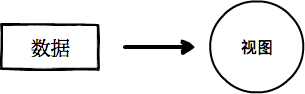
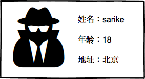
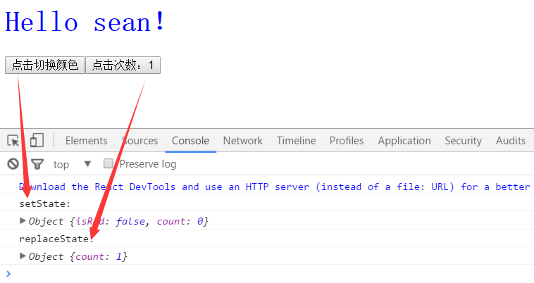

# React 学习笔记

## 一. React 概述

`React `是一个视图层的框架（库）。在传统的方式中，我们通过编写HTML代码来设计网页的结构，通过 JavaScript 以及 getElementById 等 api 来获取某个节点，通过节点的 innerHTML，innerText，appendChild 等属性或者方法（或者你也可能用JQuery）来更新视图。 

<center>**React 要做的是完成一切所需的视图层更新**</center>

 

React 中视图是数据的映射，改变数据即可使视图发生变化。

例如一个页面上展示用户的名片，名片上有<u>照片</u>、<u>姓名</u>、<u>年龄</u>、<u>地址</u>等基本信息，如下图所示： 

 

用户看到的名片就是视图，而对于React而言，这是由用户的数据映射而来，如：

```javascript
{
    photo: "my-photo.jpeg",
    name: "sarike",
    age: 18,
    address: "北京"
}
```

用户想要查看不同的名片，则React会用新的数据替换旧数据，这就是所谓的单向数据流。

**总结什么是React**

- A JAVASCRIPT LIBRARY FOR BUILDING USER INTERFACES
  - 用来构建UI的 JavaScript库
  - React 不是一个 MVC 框架，仅仅是视图（V）层的库
- [React 官网](https://facebook.github.io/react/)
- [React 中文文档](https://doc.react-china.org/)

### 1. 面向组件编程

前端开发中，对于HTML而言，它的各种元素（如：div，table，input，select等）就是最基本的组件 ，通过对它们进行组合，成为用户最终看到的视图（如上文所说的名片）。

为什么说React是面向组件编程呢？

因为：**React 提供了一种看似可以创造新 HTML 标签的能力——通过产生新的组件**

继续上面“名片”的例子，React可以创造一个标签（组件），让前端页面中可以按照需求使用这个标签，如：

```html
<Card name="sarike" age="18" address="北京" />
```

总结：**有了React，则对于一个项目，前期需要观察项目的原型或设计稿，提炼出可拆分可复用的公共组件。**

### 2. React 特点

1. **声明式设计** −React采用声明范式，可以轻松描述应用。
2. **高效** −React通过对DOM的模拟，最大限度地减少与DOM的交互。
3. **灵活** −React可以与已知的库或框架很好地配合。
4. **JSX** − JSX 是 JavaScript 语法的扩展。React 开发不一定使用 JSX ，但我们建议使用它。
5. **组件** − 通过 React 构建组件，使得代码更加容易得到复用，能够很好的应用在大项目的开发中。
6. **单向响应的数据流** − React 实现了单向响应的数据流，从而减少了重复代码，这也是它为什么比传统数据绑定更简单。

### 3 React 的安装使用

React 可以直接下载使用，官网 <http://facebook.github.io/react/> 下载最新版。

也可以直接使用 BootCDN 的 React CDN 库，地址如下：

```html
<script src="https://cdn.bootcss.com/react/15.4.2/react.min.js"></script>
<script src="https://cdn.bootcss.com/react/15.4.2/react-dom.min.js"></script>
<script src="https://cdn.bootcss.com/babel-standalone/6.22.1/babel.min.js"></script>
```

上面引用了 React 常用的三个库：

- **react.min.js** - React 的核心库
- **react-dom.min.js** - 提供与 DOM 相关的功能
- **babel.min.js** - Babel 可以将 ES6 代码转为 ES5 代码，这样我们就能在目前不支持 ES6 浏览器上执行 React 代码。Babel 内嵌了对 JSX 的支持。通过将 Babel 和 babel-sublime 包（package）一同使用可以让源码的语法渲染上升到一个全新的水平。

我们同样可以使用`create-react-app`来快速构建 React 开发环境（可能会花费较长时间）：

```shell
$ npm install -g create-react-app
$ create-react-app my-app
$ cd my-app/
$ npm start
```

在浏览器中打开 http://localhost:3000/ ，结果如下图所示：


项目的目录结构如下 :

```shell
my-app/
  README.md
  node_modules/
  package.json
  .gitignore
  public/
    favicon.ico
    index.html
  src/
    App.css
    App.js
    App.test.js
    index.css
    index.js
    logo.svg
```


## 二. React JSX

React 使用 JSX 来替代常规的 JavaScript。JSX 是一个看起来很像 XML 的 JavaScript 语法扩展。

我们不需要一定使用 JSX，但它有以下优点：

- JSX 执行更快，因为它在编译为 JavaScript 代码后进行了优化。
- 它是类型安全的，在编译过程中就能发现错误。
- 使用 JSX 编写模板更加简单快速。

实例：

```react
// 嵌套多个 HTML 标签，需要使用一个标签元素包裹它， 如 <div>, <section> 等

ReactDOM.render(
    // 使用 <div> 包裹
    <div>	// html 元素起
    <h1>React 教程</h1>
    <h2>欢迎学习 React</h2>
        // 自定义属性 'data-myattribute' 添加了 'data-' 前缀
    <p data-myattribute = "somevalue">JSX 是一个很不错的 JavaScript 库!</p>
    </div>	// html 元素终
    ,
    document.getElementById('example')
);
```

注意：实例中的 p 元素添加了自定义属性 **data-myattribute**，添加自定义属性需要使用 **data-** 前缀。 

### 1. JSX 中写 Javascript

我们可以在 JSX 中使用 JavaScript 表达式。表达式写在花括号 **{ }** 中。实例如下： 

```react
ReactDOM.render(
    <div>
      <h1>{1+1}</h1>  //前端显示计算结果：2
    </div>
    ,
    document.getElementById('example')
);
```

在 JSX 中不能使用 **if else** 语句，但可以使用 **conditional (三元运算)** 表达式来替代。以下实例中如果变量 **i** 等于 **1** 浏览器将输出 **true**, 如果修改 i 的值，则会输出 **false**。

```html
  <body>
    <div id="example"></div>
    <script type="text/babel">
	  var i = 1;
      ReactDOM.render(
      	<div>
      	  <h1>{i == 1 ? 'True' : 'False'}</h1>   // True
        </div>
      	,
      	document.getElementById('example')
      );
    </script>
  </body>
```

### 2. JSX 内联样式

React 推荐使用内联样式。我们可以使用 **camelCase** 语法来设置内联样式. React 会在指定元素数字后自动添加 **px** 。以下实例演示了为 **h1** 元素添加 **myStyle** 内联样式： 

```html
<script type="text/babel">
	var myStyle = {
		fontSize: 100,
		color: '#FF0000'
	};
	ReactDOM.render(
		<h1 style={myStyle} > React 教程 </h1> ,
		document.getElementById('example')
	);
</script>
```

### 3. JSX 的注释

JSX 注释需分两种情况：

- 在标签内部的注释需要花括号
- 在标签外的的注释不能使用花括号

```react
ReactDOM.render(
    /*注释 */
    <h1> Hello world {/*注释*/}</h1>,
    document.getElementById('example')
);
```

### 4. JSX 数组

JSX 允许在模板中插入数组，数组会<u>自动展开</u>所有成员，实例如下：

```react
  <body>
    <div id="example"></div>
    <script type="text/babel">
      var arr = [
        <h1>React 教程</h1>,
        <h2>学的不仅是技术，更是梦想！</h2>,
      ];
      ReactDOM.render(
        <div>{arr}</div>,  {/* arr 会自动展开 */}
        document.getElementById('example')
      );
    </script>
  </body>
```

页面效果：


### 5. 区分 HTML 标签和 React 组件

React 即可以渲染 HTML 标签 (strings) 又可以渲染 React 组件 (classes)。 

通常要渲染 HTML 标签，只需在 JSX 里使用小写字母的标签名。 要渲染 React 组件，创建一个大写字母开头的本地变量。 示例：

```react
// 渲染 HTML 标签 
var myDivElement = <div className="foo" />;
ReactDOM.render(myDivElement, document.getElementById('example'));

// 渲染 React 组件
var MyComponent = React.createClass({/*...*/});
var myElement = <MyComponent someProperty={true} />;
ReactDOM.render(myElement, document.getElementById('example'));
```

React 的 JSX 使用大、小写的约定来区分本地组件的类和 HTML 标签。 

## 三. React 组件

组件的正确使用会使得我们的应用更容易来管理。

### 1. 构建 Reac 组件

React推出后，出于不同的原因先后出现三种定义react组件的方式，殊途同归；具体的三种方式：

1. 函数式定义的`无状态组件`
2. es5原生方式`React.createClass`定义的组件
3. es6形式的`extends React.Component`定义的组件

#### （1）无状态函数式组件

创建[无状态函数式组件形式](https://facebook.github.io/react/blog/2015/10/07/react-v0.14.html#stateless-functional-components)是从`React 0.14`版本开始出现的。它是为了创建纯展示组件，这种组件只负责根据传入的`props`来展示，不涉及到要`state`状态的操作。具体的*无状态函数式组件*，其官方指出： 

```
	在大部分React代码中，大多数组件被写成无状态的组件，通过简单组合可以构建成其他的组件等；这种通过多个简单然后合并成一个大应用的设计模式被提倡。
```

无状态函数式组件形式上表现为一个只带有一个`render`方法的组件类，通过函数形式或者ES6 arrow function的形式在创建，并且该组件是无`state`状态的。具体的创建形式如下： 

```react
function HelloComponent(props, /* context */) {
  return <div>Hello {props.name}</div>
}
ReactDOM.render(<HelloComponent name="Sebastian" />, mountNode) 
```

无状态组件的创建形式使代码的可读性更好，并且减少了大量冗余的代码，精简至只有一个render方法，大大的增强了编写一个组件的便利，除此之外无状态组件还有以下几个显著的特点：

1. **组件不会被实例化，整体渲染性能得到提升**
   因为组件被精简成一个render方法的函数来实现的，由于是无状态组件，所以无状态组件就不会在有组件实例化的过程，无实例化过程也就不需要分配多余的内存，从而性能得到一定的提升。
2. **组件不能访问this对象**
   无状态组件由于没有实例化过程，所以无法访问组件this中的对象，例如：`this.ref`、`this.state`等均不能访问。若想访问就不能使用这种形式来创建组件
3. **组件无法访问生命周期的方法**
   因为无状态组件是不需要组件生命周期管理和状态管理，所以底层实现这种形式的组件时是不会实现组件的生命周期方法。所以无状态组件是不能参与组件的各个生命周期管理的。
4. **无状态组件只能访问输入的props，同样的props会得到同样的渲染结果，不会有副作用**

无状态组件被鼓励在大型项目中尽可能以简单的写法来分割原本庞大的组件，未来React也会这种面向无状态组件在譬如无意义的检查和内存分配领域进行一系列优化，所以**只要有可能，尽量使用无状态组件**。

#### （2）React.createClass

`React.createClass`是react刚开始推荐的创建组件的方式，这是**ES5**的原生的JavaScript来实现的React组件，其形式如下： 

```react
var InputControlES5 = React.createClass({
    propTypes: {
        //定义传入props中的属性各种类型
        initialValue: React.PropTypes.string
    },
    defaultProps: { 
        //组件默认的props对象
        initialValue: ''
    },
    
    // 设置 initial state
    getInitialState: function() {//组件相关的状态对象
        return {
            text: this.props.initialValue || 'placeholder'
        };
    },
    handleChange: function(event) {
        this.setState({ 
            //this represents react component instance
            text: event.target.value 	//返回被点击节点的value
        });
    },
    render: function() {
        return (
            <div>
                Type something:
                <input onChange={this.handleChange} value={this.state.text} />
            </div>
        );
    }
});
InputControlES6.propTypes = {
    initialValue: React.PropTypes.string
};
InputControlES6.defaultProps = {
    initialValue: ''
};
```

与无状态组件相比，`React.createClass`和后面要描述的`React.Component`都是创建有状态的组件，这些组件是要被实例化的，并且可以访问组件的生命周期方法。但是随着React的发展，`React.createClass`形式自身的问题暴露出来：

- React.createClass会自绑定函数方法（不像React.Component只绑定需要关心的函数）导致不必要的性能开销，增加代码过时的可能性。
- React.createClass的mixins不够自然、直观；React.Component形式非常适合高阶组件（Higher Order Components--HOC）,它以更直观的形式展示了比mixins更强大的功能，并且HOC是纯净的JavaScript，不用担心他们会被废弃。HOC可以参考[无状态组件(Stateless Component) 与高阶组件](http://www.jianshu.com/p/63569386befc)。

再看一个简单的示例：

```react
// 封装一个输出 "Hello World！" 的组件，组件名为 HelloMessage
var HelloMessage = React.createClass({
  render: function() {
    return <h1>Hello World！</h1>;
  }
});
 
ReactDOM.render(
  <HelloMessage />,
  document.getElementById('example')   //注意：此处无`;`号
);
```

**分析：**

- `React.createClass()`方法用于生成一个组建类`HelloMessage`。
- `<HelloMessage />`示例化组件类输出到视图。

**注意：**

- 原生 HTML 元素名以小写字母开头，而自定义的 React 类名以大写字母开头， HelloMessage 不能写成 helloMessage。
- 组件类只能包含一个顶层标签（即包裹这个部分的标签 ），否则也会报错。
-  `ReactDOM.render()`最后一个元素后没有分号`;`。

```react
var HelloMessage = React.createClass({
  render: function() {
    return （
    <h1>
      Hello {this.props.name}
    </h1>
    <p>
      some text
    </p>）;
  }
});
// 错误: 既有<h1></h1>又有<p></p>，两个顶层标签
```

#### （3）React.Component

`React.Component`是以ES6的形式来创建react的组件的，是React目前极为推荐的创建有状态组件的方式，最终会取代`React.createClass`形式；相对于 `React.createClass`可以更好实现代码复用。将上面`React.createClass`的形式改为`React.Component`形式如下：

```react
class InputControlES6 extends React.Component { //继承 extends
    constructor(props) {
        super(props);

        // 设置 initial state
        this.state = {
            text: props.initialValue || 'placeholder'
        };

        // ES6 类中函数必须手动绑定
        this.handleChange = this.handleChange.bind(this);
    }

    handleChange(event) {
        this.setState({
            text: event.target.value
        });
    }

    render() {
        return (
            <div>
                Type something:
                <input onChange={this.handleChange}
               value={this.state.text} />
            </div>
        );
    }
}
InputControlES6.propTypes = {
    initialValue: React.PropTypes.string
};
InputControlES6.defaultProps = {
    initialValue: ''
};
```

#### （4）React.createClass与React.Component区别

根据上面展示代码中二者定义组件的语法格式不同之外，二者还有很多重要的区别，下面就描述一下二者的主要区别。

**a. 函数this自绑定**

`React.createClass`创建的组件，其每一个成员函数的this都由React自动绑定，任何时候使用，直接使用`this.method`即可，函数中的`this`会被正确设置。

```react
const Contacts = React.createClass({  
  handleClick() {
    console.log(this); // React Component instance
  },
  render() {
    return (
      <div onClick={this.handleClick}></div>
    );
  }
});
```

`React.Component`创建的组件，其成员函数不会自动绑定this，需要开发者手动绑定，否则this不能获取当前组件实例对象。

```
class Contacts extends React.Component {  
  constructor(props) {
    super(props);
  }
  handleClick() {
    console.log(this); // null
  }
  render() {
    return (
      <div onClick={this.handleClick}></div>
    );
  }
```

当然，`React.Component`有三种手动绑定方法：可以在构造函数中完成绑定，也可以在调用时使用`method.bind(this)`来完成绑定，还可以使用arrow function来绑定。拿上例的`handleClick`函数来说，其绑定可以有：

```react
    constructor(props) {
       super(props);
       this.handleClick = this.handleClick.bind(this); //构造函数中绑定
  }
```

```react
    <div onClick={this.handleClick.bind(this)}></div> //使用bind来绑定
```

```react
    <div onClick={()=>this.handleClick()}></div> //使用arrow function来绑定
```

**组件属性类型propTypes及其默认props属性defaultProps配置不同**

`React.createClass`在创建组件时，有关组件props的属性类型及组件默认的属性会作为**组件实例的属性**来配置，其中defaultProps是使用`getDefaultProps`的方法来获取默认组件属性的

```react
//ES5 通过实例化 propTypes 属性和 getDefaultProps 方法获取
const TodoItem = React.createClass({
    propTypes: { // as an object
        name: React.PropTypes.string
    },
    getDefaultProps(){   // return a object
        return {
            name: ''    
        }
    }
    render(){
        return <div></div>
    }
})
```

`React.Component`在创建组件时配置这两个对应信息时，他们是作为**组件类的属性**，不是组件实例的属性，也就是所谓的**类的静态属性**来配置的。对应上面配置如下：

```react
// ES6 propTypes 和 defaultProps 成为了组件的 Static 静态属性
class TodoItem extends React.Component {
    static propTypes = {//类的静态属性
        name: React.PropTypes.string
    };

    static defaultProps = {//类的静态属性
        name: ''
    };

    ...
}
```

**组件初始状态state的配置不同**

`React.createClass`创建的组件，其状态state是通过`getInitialState`方法来配置组件相关的状态；
`React.Component`创建的组件，其状态state是在`constructor`中像初始化组件属性一样声明的。

```react
// ES5 通过getInitialState声明
const TodoItem = React.createClass({
    // return an object
    getInitialState(){ 
        return {
            isEditing: false
        }
    }
    render(){
        return <div></div>
    }
})
```

```react
// ES6 constructor中this.state{}内声明
class TodoItem extends React.Component{
    constructor(props){
        super(props);
        this.state = { // define this.state in constructor
            isEditing: false
        } 
    }
    render(){
        return <div></div>
    }
}
```

**Mixins的支持不同**

[`Mixins`](https://facebook.github.io/react/docs/reusable-components-zh-CN.html#mixins)（混入）是面向对象编程OOP（Object Oriented Programming）的一种实现，其作用是为了复用共有的代码，将共有的代码通过抽取为一个对象，然后通过`Mixins`进该对象来达到代码复用。具体可以参考[React Mixin的前世今生](http://www.w3ctech.com/topic/1599)。

`React.createClass`在创建组件时可以使用`mixins`属性，以数组的形式来混合类的集合。

```react
var SomeMixin = {  
  doSomething() {

  }
};
const Contacts = React.createClass({  
  mixins: [SomeMixin],
  handleClick() {
    this.doSomething(); // use mixin
  },
  render() {
    return (
      <div onClick={this.handleClick}></div>
    );
  }
});
```

但是遗憾的是`React.Component`这种形式并不支持`Mixins`，至今React团队还没有给出一个该形式下的官方解决方案；但是React开发者社区提供一个全新的方式来取代`Mixins`,那就是**Higher-Order Components**，具体细节可以参考[这篇文章](https://leozdgao.me/chushi-hoc/)

### 2. 组件参数传递

若需要向组件传递参数，可以使用` this.props`对象,实例如下： 

```react
var HelloMessage = React.createClass({
  render: function() {
    return <h1>Hello {this.props.name}</h1>;
  }
});
 
ReactDOM.render(
  <HelloMessage name="Runoob" />,
  document.getElementById('example')
);
```

**分析：**

以上实例中 `name `属性通过` this.props.name` 来获取。 

### 3. 复合组件

我们可以通过创建多个组件来合成一个组件，即把组件的不同功能点进行分离。

以下实例我们实现了输出网站名字和网址的组件：

```react
var WebSite = React.createClass({
  render: function() {
    return (
      <div>
        <Name name={this.props.name} />
        <Link site={this.props.site} />
      </div>
    );
  }
});
 
var Name = React.createClass({
  render: function() {
    return (
      <h1>{this.props.name}</h1>
    );
  }
});
 
var Link = React.createClass({
  render: function() {
    return (
      <a href={this.props.site}>
        {this.props.site}
      </a>
    );
  }
});
 
ReactDOM.render(
  <WebSite name="React 教程" site="https://facebook.github.io/react" />,
  document.getElementById('example')
);
```

**分析：**

- `React.createClass( )`创建了三个组件`WebSite`，`Name`和`Link`，都属于自定义的 React 类名以大写字母开头。
- 三个组件内部都只有一个顶层标签包裹，分别是`<div>`，`<h1>`和`<a>`。
- `WebSite`组件同时调用了`Name`和`Link`组件，也就是说 WebSite 同时拥有 Name 和 Link 的实例 。

## 四. React State

React 把组件看成是一个状态机（State Machines）。通过与用户的交互，实现不同状态，然后渲染 UI，让用户界面和数据保持一致。 请看实例：

```react
var LikeButton = React.createClass({
	getInitialState: function() {
		return {liked: this.props.liked};
	},
	handleClick: function(event) {
		this.setState({liked: this.state.liked=='y'?'n':'y'});
	},
	render: function() {
		var text = this.state.liked=='y' ? '喜欢' : '不喜欢';
		return (
			<p onClick={this.handleClick}>
			你<b>{text}</b>我。点我切换状态。
			</p>
		);
	}
});

ReactDOM.render(
	<LikeButton liked="y" />,
	document.getElementById('example')
);
```

**分析：**

- 创建了自定义组件`LikeButton`；
- `LikeButton`中包含了三个方法：
  - `getInitialState`：获取`this.state.liked`默认值；
  - `handleClick`：对`onClick`事件监听；
  - `render`：渲染内容。
- `this.setState()`修改`this.state.liked`状态值，每次修改以后，会自动调用`this.render` 方法 ，重新渲染。
- `React.createClass()`中的方法会依次调用，最后执行`render()`。

### 1. 默认 State

通过`getInitialState()`方法为`state`设置默认值，实例如下：

```

```

## 五. React Props

`state` 和 `props `主要的区别在于 **props** 是不可变的，而 **state** 可以根据与用户交互来改变。

因此组件设计时，需要定义 state 来更新和修改数据，而子组件只能通过 props 来传递数据。

### 1. 默认 Props 

通过` getDefaultProps() `方法为`props`设置默认值，实例如下：  

```react
var HelloMessage = React.createClass({
  getDefaultProps: function() {
    return {
      /*默认的name='Runoob'*/
      name: 'Runoob'  
    };
  },
  render: function() {
    return <h1>Hello {this.props.name}</h1>;
  }
});
 
ReactDOM.render(
  <HelloMessage />,
  document.getElementById('example')
);
```

### 2. State 和 Props 组合使用

以下实例演示了如何在应用中组合使用 state 和 props 。我们可以在父组件中设置 state， 并通过在子组件上使用 props 将其传递到子组件上。 

```react
var WebSite = React.createClass({
  getInitialState: function() {
    return {
      name: "菜鸟教程",
      site: "http://www.runoob.com"
    };
  },
 
  render: function() {
    return (
      <div>
        <Name name={this.state.name} />
        <Link site={this.state.site} />
      </div>
    );
  }
});
 
var Name = React.createClass({
  render: function() {
    return (
      <h1>{this.props.name}</h1>
    );
  }
});
 
var Link = React.createClass({
  render: function() {
    return (
      <a href={this.props.site}>
        {this.props.site}
      </a>
    );
  }
});
 
ReactDOM.render(
  <WebSite />,
  document.getElementById('example')
);
```

### 3. Props 验证

Props 验证使用 `propTypes`，它可以保证我们的应用组件被正确使用，React.PropTypes 提供很多验证器 (validator) 来验证传入数据是否有效。当向 props 传入无效数据时，JavaScript 控制台会抛出警告。 

以下实例创建一个 `Mytitle `组件，属性` title` 是不能为空的且必须是字符串类型，非字符串类型会自动转换为字符串 ： 

```react
var title = "React 教程";
// var title = 123;
var MyTitle = React.createClass({
  // 通过 propTypes 对 props.parmas 进行验证
  propTypes: {
    title: React.PropTypes.string.isRequired,
  },
 
  render: function() {
     return <h1> {this.props.title} </h1>;
   }
});
ReactDOM.render(
    <MyTitle title={title} />,
    document.getElementById('example')
);
```

**分析：**

- `propTypes`里规定`propsName`对应的数据要求；
- `.string`要求必须强制转换成String类型，`.isRequired`规定不能为空；

`React.PropTypes`后加入的是Props验证器，更多验证器的说明如下：

```react
React.createClass({
  propTypes: {
    // 可以声明 prop 为指定的 JS 基本数据类型，默认情况，这些数据是可选的
    optionalArray: React.PropTypes.array,
    optionalBool: React.PropTypes.bool,
    optionalFunc: React.PropTypes.func,
    optionalNumber: React.PropTypes.number,
    optionalObject: React.PropTypes.object,
    optionalString: React.PropTypes.string,
 
    // 可以被渲染的对象 numbers, strings, elements 或 array
    optionalNode: React.PropTypes.node,
 
    //  React 元素
    optionalElement: React.PropTypes.element,
 
    // 用 JS 的 instanceof 操作符声明 prop 为类的实例。
    optionalMessage: React.PropTypes.instanceOf(Message),
 
    // 用 enum 来限制 prop 只接受指定的值。
    optionalEnum: React.PropTypes.oneOf(['News', 'Photos']),
 
    // 可以是多个对象类型中的一个
    optionalUnion: React.PropTypes.oneOfType([
      React.PropTypes.string,
      React.PropTypes.number,
      React.PropTypes.instanceOf(Message)
    ]),
 
    // 指定类型组成的数组
    optionalArrayOf: React.PropTypes.arrayOf(React.PropTypes.number),
 
    // 指定类型的属性构成的对象
    optionalObjectOf: React.PropTypes.objectOf(React.PropTypes.number),
 
    // 特定 shape 参数的对象
    optionalObjectWithShape: React.PropTypes.shape({
      color: React.PropTypes.string,
      fontSize: React.PropTypes.number
    }),
 
    // 任意类型加上 `isRequired` 来使 prop 不可空。
    requiredFunc: React.PropTypes.func.isRequired,
 
    // 不可空的任意类型
    requiredAny: React.PropTypes.any.isRequired,
 
    // 自定义验证器。如果验证失败需要返回一个 Error 对象。不要直接使用 `console.warn` 或抛异常，因为这样 `oneOfType` 会失效。
    customProp: function(props, propName, componentName) {
      if (!/matchme/.test(props[propName])) {
        return new Error('Validation failed!');
      }
    }
      
    // 自定义验证器2
    name: (props, propName) => {  // 自定义验证
    console.log(props, propName);
    if (typeof props[propName] !== 'string') {
      return new Error('必须传递一个字符串');
    } else if (props[propName].length >= 5) {
      return new Error('字符串长度必须小于5')
    } else {
      return null;
    }
  }
      
  },
  /* ... */
});
```

## 六. React 组件 API

将讲解以下7个方法:

- 设置状态：setState
- 替换状态：replaceState
- 设置属性：setProps
- 替换属性：replaceProps
- 强制更新：forceUpdate
- 获取DOM节点：findDOMNode
- 判断组件挂载状态：isMounted

### 1. setState 设置状态

```react
setState(object nextState[, function callback])
```

**参数说明**

- **nextState**，将要设置的新状态，该状态会和当前的**state**合并
- **callback**，可选参数，回调函数。该函数会在**setState**设置成功，且组件重新渲染后调用。

合并nextState和当前state，并重新渲染组件。setState是React事件处理函数中和请求回调函数中触发UI更新的主要方法。 

**setState 的注意事项**

- 不能在组件内部通过`this.state`修改状态，因为该状态会在调用`setState()`后被替换。
- `setState()`并不会立即改变`this.state`，而是创建一个即将处理的state。`setState()`并不一定是同步的，为了提升性能React会批量执行state和DOM渲染。
- `setState()`总是会触发一次组件重绘，除非在`shouldComponentUpdate()`中实现了一些条件渲染逻辑。

**实例**

```react
// 通过点击 h2 标签来使得点击计数器加 1。
var Counter = React.createClass({
  getInitialState: function () {
    return { clickCount: 0 };
  },
  handleClick: function () {
    this.setState(function(state) {
      return {clickCount: state.clickCount + 1};
    });
  },
  render: function () {
    return (
        <h2 onClick={this.handleClick}>
            点我！点击次数为: {this.state.clickCount}
        </h2>
    );
  }
});
ReactDOM.render(
  <Counter />,
  document.getElementById('message')
);
```

### 2. replaceState 替换状态

```react
setProps(object nextProps[, function callback])
```

**参数说明**

- **nextState**，将要设置的新状态，该状态会替换当前的**state**。
- **callback**，可选参数，回调函数。该函数会在**replaceState**设置成功，且组件重新渲染后调用。

`replaceState()`方法与`setState()`类似，但是方法只会保留**nextState**中状态，原**state**不在**nextState**中的状态都会被删除。 

**区别 setState 和 replaceState**

- **setState，**将要设置的新状态，该状态会和当前的**state**合并。
- **repalceState，**将要设置的新状态，该状态会替换当前的**state**。

请看实例：

```react
var HelloMessage = React.createClass({
    getInitialState: function() {
        return { 
            isRed : true,
            count:0
         };
    },
    // 设置了两个button，一个调用setState() 另一个调用replaceState()
    handleClick1: function(){
        this.setState({isRed : !this.state.isRed},function(){
            console.log("setState:");
            console.log(this.state);
            // Object{isRead: false, count: 0} 所有state合并输出
        });
    },
    
    handleClick2: function(){
        this.replaceState({count : this.state.count+1},function(){
            console.log("replaceState:");
            console.log(this.state);
            // Object{count: 1} 仅replace的state被返回了
        });
    },
    
    render: function() {
		var redStyle = {
			color:'red'
		};
		var blueStyle = {
			color:'blue'
		};
    	return (
        	<div>
				<h1 style={this.state.isRed ? redStyle : blueStyle}>
                    Hello {this.props.name}！
				</h1>
				<button onClick={this.handleClick1}>点击切换颜色</button>
				<button onClick={this.handleClick2}>点击次数：{this.state.count}</button>
        	</div>
		);
	}
});

ReactDOM.render(
    <HelloMessage name='sean' />,
    document.getElementById("example")
);
```

运行结果：



通过运行结果我们可以知道，点击第一个button时，调用 setState() ，会将新状态合并到当前状态，因此，状态 isRed 更新到最新状态，而状态 count 没有改变，保持原有状态。

当点击第二个button时，调用 replaceState()，替换当前的状态，由于replaceState()中只设置状态 count ， 因此state中只有count一个状态，由于isRed状态不存在，`this.state.isRed ? redStyle : blueStyle`中 `this.state.isRed`为false，这样显示的样式为 `blueStyle`。

### 3. setProps 设置属性

```react
setProps(object nextProps[, function callback])
```

**参数说明**

- **nextProps**，将要设置的新属性，该状态会和当前的**props**合并
- **callback**，可选参数，回调函数。该函数会在**setProps**设置成功，且组件重新渲染后调用。

**功能**

设置组件属性，并重新渲染组件。

**props**相当于组件的数据流，它总是会从父组件向下传递至所有的子组件中。当和一个外部的JavaScript应用集成时，我们可能会需要向组件传递数据或通知**React.render()**组件需要重新渲染，可以使用**setProps()**。

更新组件，我可以在节点上再次调用**React.render()**，也可以通过**setProps()**方法改变组件属性，触发组件重新渲染。

### 4. replaceProps 替换属性

```react
replaceProps(object nextProps[, function callback])
```

**参数说明**

- **nextProps**，将要设置的新属性，该属性会替换当前的**props**。
- **callback**，可选参数，回调函数。该函数会在**replaceProps**设置成功，且组件重新渲染后调用。

**replaceProps()**方法与**setProps**类似，但它会删除原有 props。 

### 5. forceUpdate 强制更新

```react
forceUpdate([function callback])
```

**参数说明**

- **callback**，可选参数，回调函数。该函数会在组件**render()**方法调用后调用。

`forceUpdate()`方法会使组件调用自身的`render()`方法重新渲染组件，组件的子组件也会调用自己的render()。但是，组件重新渲染时，依然会读取this.props和this.state，如果状态没有改变，那么React只会更新DOM。

forceUpdate()方法适用于this.props和this.state之外的组件重绘（如：修改了this.state后），通过该方法通知React需要调用render()

一般来说，应该尽量避免使用forceUpdate()，而仅从this.props和this.state中读取状态并由React触发render()调用。

### 6. findDOMNode 获取DOM节点

```react
DOMElement findDOMNode()
```

**参数说明**

- 返回值：DOM元素`DOMElement`

如果组件已经挂载到DOM中，该方法返回对应的本地浏览器 DOM 元素。当`render`返回**null** 或 **false**时，`this.findDOMNode()`也会返回**null**。从DOM 中读取值的时候，该方法很有用，如：获取表单字段的值和做一些 DOM 操作。 

### 7. isMounted 判断组件挂载状态

```react
bool isMounted()
```

**参数说明**

- 返回值：**true**或**false**，表示组件是否已挂载到DOM中

`isMounted()`方法用于判断组件是否已挂载到DOM中。可以使用该方法保证了`setState()`和`forceUpdate()`在异步场景下的调用不会出错。 

### 8. 附加：DOM 节点

在 HTML DOM 中，根据 W3C 的 HTML DOM 标准，HTML 文档中的所有内容都是节点：

- 整个文档是一个文档节点
- 每个 HTML 元素是元素节点
- HTML 元素内的文本是文本节点
- 每个 HTML 属性是属性节点
- 注释是注释节点

HTML DOM 将 HTML 文档视作树结构。这种结构被称为**节点树**： 


通过 HTML DOM，树中的所有节点均可通过 JavaScript 进行访问。所有 HTML 元素（节点）均可被修改，也可以创建或删除节点。 

## 七. React 组件生命周期

### 1. 组件声明周期状态

组件的生命周期可分成三个状态：

- **Mounting**：已插入真实 DOM
- **Updating**：正在被重新渲染
- **Unmounting**：已移出真实 DOM

### 2. 生命周期方法

生命周期的方法有：

- **componentWillMount** 在渲染前调用,在客户端也在服务端。
- **componentDidMount** : 在第一次渲染后调用，只在客户端。之后组件已经生成了对应的DOM结构，可以通过`this.getDOMNode()`来进行访问。 如果你想和其他JavaScript框架一起使用，可以在这个方法中调用`setTimeout`, `setInterval`或者发送AJAX请求等操作(防止异部操作阻塞UI)。
- **componentWillReceiveProps** 在组件接收到一个新的 prop (更新后)时被调用。这个方法在初始化render时不会被调用。
- **shouldComponentUpdate** 返回一个布尔值。在组件接收到新的props或者state时被调用。在初始化时或者使用forceUpdate时不被调用。 
  可以在你确认不需要更新组件时使用。
- **componentWillUpdate**在组件接收到新的props或者state但还没有render时被调用。在初始化时不会被调用。
- **componentDidUpdate** 在组件完成更新后立即调用。在初始化时不会被调用。
- **componentWillUnmount**在组件从 DOM 中移除的时候立刻被调用。

以下实例在 Hello 组件加载以后，通过` componentDidMount `方法设置一个定时器，每隔100毫秒重新设置组件的透明度，并重新渲染： 

```react
var Hello = React.createClass({
  getInitialState: function () {
    return {
      opacity: 1.0
    };
  },
 
  componentDidMount: function () {
    this.timer = setInterval(function () {
      var opacity = this.state.opacity;
      opacity -= .05;
      if (opacity < 0.1) {
        opacity = 1.0;
      }
      this.setState({
        opacity: opacity
      });
    }.bind(this), 100);
  },
 
  render: function () {
    return (
      <div style={{opacity: this.state.opacity}}>
        Hello {this.props.name}
      </div>
    );
  }
});
 
ReactDOM.render(
  <Hello name="world"/>,
  document.body
);
```

## 八. React AJAX

- **componentDidMount** : 在第一次渲染后调用，只在客户端。之后组件已经生成了对应的DOM结构，可以通过`this.getDOMNode()`来进行访问。 如果你想和其他JavaScript框架一起使用，可以在这个方法中调用`setTimeout`, `setInterval`或者发送AJAX请求等操作(防止异部操作阻塞UI)。
- **componentWillUnmount**在组件从 DOM 中移除的时候立刻被调用。

React 组件的数据可以通过 `componentDidMount `方法中的 **Ajax** 来获取，当从服务端获取数据时可以将数据存储在 **state** 中，再用 `this.setState `方法重新渲染 UI。 

当使用异步加载数据时，在组件卸载前使用 `componentWillUnmount` 来取消未完成的请求。 

以下实例演示了获取 Github 用户最新 gist 共享描述：

```javascript
// 使用 jQuery 完成 Ajax 请求
var UserGist = React.createClass({
  getInitialState: function() {
    return {
      username: '',
      lastGistUrl: ''
    };
  },
 
  componentDidMount: function() {
    this.serverRequest = $.get(this.props.source, function (result) {
      var lastGist = result[0];
      this.setState({
        username: lastGist.owner.login,
        lastGistUrl: lastGist.html_url
      });
    }.bind(this));
  },
 
  componentWillUnmount: function() {
    this.serverRequest.abort();
  },
 
  render: function() {
    return (
      <div>
        {this.state.username} 用户最新的 Gist 共享地址：
        <a href={this.state.lastGistUrl}>{this.state.lastGistUrl}</a>
      </div>
    );
  }
});
 
ReactDOM.render(
  <UserGist source="https://api.github.com/users/octocat/gists" />,
  mountNode
);
```

