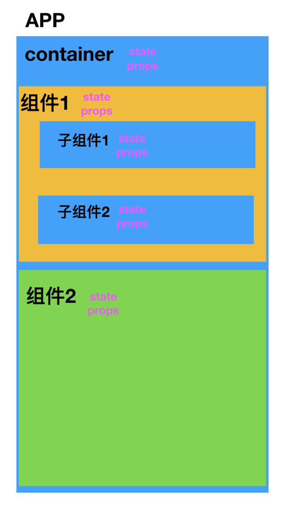
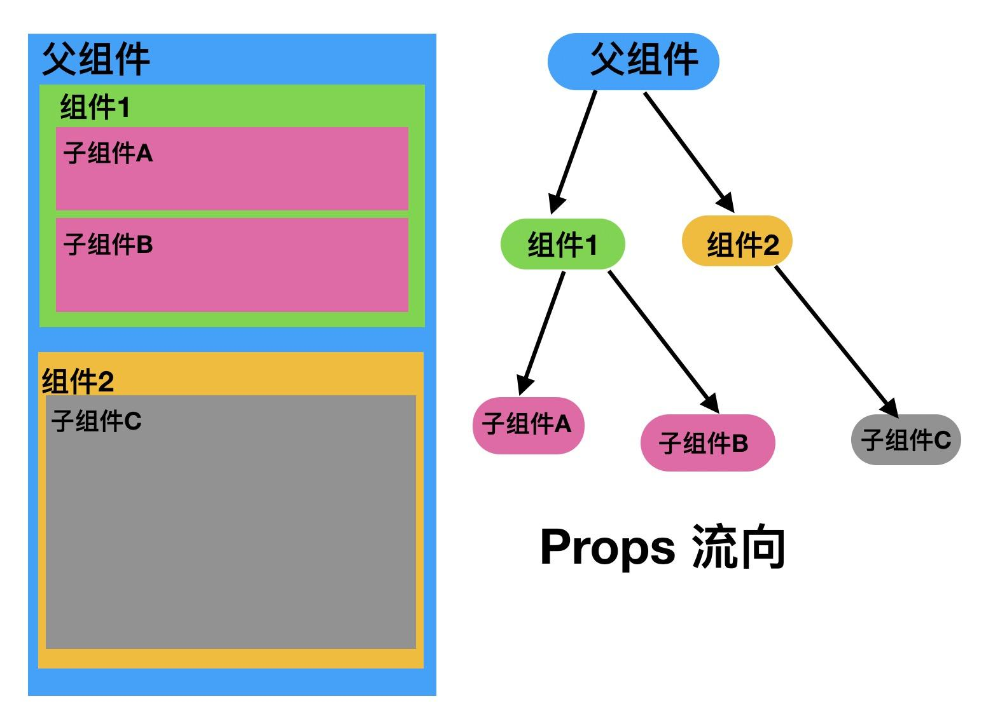
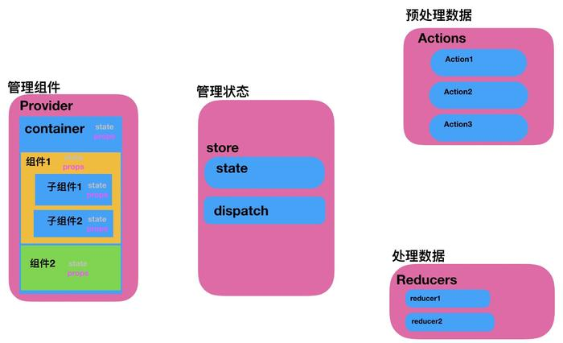

# 了解 Redux 

Redux 在线交流QQ群：323151404（已满）、280529396（已满）、321458777

英文原版：<http://redux.js.org/>	中文版：http://www.redux.org.cn/

安装：

```shell
npm install --save redux
npm install --save react-redux  ( React 绑定库 )
npm install --save-dev redux-devtools  ( 可选，开发者工具 )
```

## 0. why redux ?

没有使用 redux 的项目，大概可以概括一下就是整个APP作为容器，里面存放有多个父组件、子组件、孙子组件...各个组件都含有state和props这两个最重要的属性：



React有props和state: props意味着父级分发下来的属性，state意味着组件内部可以自行管理的状态，并且整个React没有数据向上回溯的能力，也就是说数据只能单向向下分发，或者自行内部消化state的变化会引起页面的刷新. 



组件之间交互比较困难,当APP中页面较多,页面内组件比较复杂,通过修改state的方式重新渲染页面,就会出现卡到爆炸的效果.所以这种方式只适合实现一些功能相对单一,页面简介,页面之间交互较少,结构简单的APP.

下面,来看一下使用了redux的APP结构,下面画了一张图,多出来右边三个部分,原来container外层多了一个Provider




应用中所有的 `state `都以一个对象树的形式储存在一个单一的` store` 中。 惟一改变 `state` 的办法是触发` action`*，一个描述发生什么的对象。*

为了描述 `action` 如何改变 `state 树`，你需要编写 `reducers`。 

```react
import { createStore } from 'redux';

/**
 * 这是一个 reducer，形式为 (state, action) => state 的纯函数。
 * 描述了 action 如何把 state 转变成下一个 state。
 *
 * state 的形式取决于你，可以是基本类型、数组、对象、
 * 甚至是 Immutable.js 生成的数据结构。惟一的要点是
 * 当 state 变化时需要返回全新的对象，而不是修改传入的参数。
 *
 * 下面例子使用 `switch` 语句和字符串来做判断，但你可以写帮助类(helper)
 * 根据不同的约定（如方法映射）来判断，只要适用你的项目即可。
 */
function counter(state = 0, action) {
  switch (action.type) {
  case 'INCREMENT':
    return state + 1;
  case 'DECREMENT':
    return state - 1;
  default:
    return state;
  }
}

// 创建 Redux store 来存放应用的状态。
// API 是 { subscribe, dispatch, getState }。
let store = createStore(counter);

// 可以手动订阅更新，也可以事件绑定到视图层。
store.subscribe(() =>
  console.log(store.getState())
);

// 改变内部 state 惟一方法是 dispatch 一个 action。
// action 可以被序列化，用日记记录和储存下来，后期还可以以回放的方式执行
store.dispatch({ type: 'INCREMENT' });
// 1
store.dispatch({ type: 'INCREMENT' });
// 2
store.dispatch({ type: 'DECREMENT' });
// 1
```

## 一 理解 Action ActionTypes Reducer Store

**ActionTypes**：就是对所有 `action` 进行定义，每一种 action 对应一个 `AcitonType` ，也就是 action 的名称

**Action** : 就是一个对象，他是 `key-value` 类型的，我们称他为 `action 对象` 他的第一个值是固定的 `type` ：

```json
{ 
	type : 'YourDefineType',      // 固定，必须为 type 即 ActionTypes 中的一个
	key1 : 'value1',
	key2 : 'value2'
}
```

**ActionCreator**：由于用户的每次操作都（action），每次生成一个 `action 对象` 手写速度就会较慢，所以我们需要做一个 `ActionCreator` 来自动生成 Action：

```react
// 例如登陆操作
import Types form './loginTypes';

// 无 ActionCreator 情况, 每一个 Action 的参数都自己写，然后再 dispatch 给 Reducer
constant loginIn = {
	type: 'LOGIN_IN',
	user: 'userInfo-1',
	password: 'userPwd-1'
}
export loginIn;

// 默认使用 thunk 中间件的情况下， 
// 存在 ActionCreator 情况, 直接调用 function ，自动生成 Action 并且发送给 Reducer
export function loginIn(userInfo,pwd){
    // 因为使用了 thunk 中间件，所以他会知道 dispath 函数
    return dispatch => {  // 等同于 return function(dispath){}
        dispatch({
            type:'LOGIN_IN',
            user: userInfo,
            password：pwd
        });
    }
}

```

**Reducer**：就是一个工厂函数，传入 `state` 为空的话用自己默认的模板，然后根据传入的 `action` 来判断 `state` 的改变：

```react
// 默认 Action 的 Types
import Types from './constants/actionTypes';

// 默认 state
const initialState = {
    key1 : 'value1',
    key2 : 'value2'
}
function fn ( state = initailState, action ) {	// 通过 action.type 来判断操作
    switch( action.type ) {
        case Types.type1:
            return {
                ...state,
                key1: state.key1 ++,
                key2: state.key2 --
            }
            break;
        case Types.type2:
            return {
                ...state,
                key1: state.key1 --,
                key2: state.key2 ++
            }
            break;
        default:
            return state;
    }
}
```

**Store**：就是一个 `全局对象` ，注意，不是全局变量，他的作用是将 `action` 、 `reducer` 以及 ` state` 联系在一起

- 维护应用的 `state`
-  `getState()` 方法获取 state
-  `dispatch(action)` 方法更新 state
- `subscrible` 注册监听器
